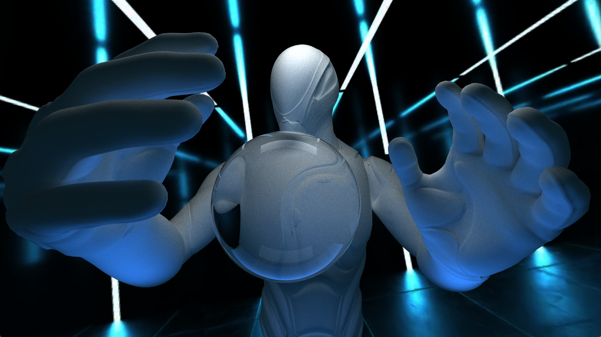

CUDA Path Tracer
================


**University of Pennsylvania, CIS 565: GPU Programming and Architecture, Project 3**

* Jiangman(Lobi) Zhao
  * [Lobi Zhao - LinkedIn](https://www.linkedin.com/in/lobizhao/), [Lobi Zhao - personal website](https://lobizhao.github.io/).
* Tested on: Windows 11 Pro, i5-10600KF @ 4.10GHz 32GB, RTX 3080 10GB
### Part 1
#### Performance
#### analysis
### Part 2
#### Material 
#### Geometry
#### Env
#### Camera
Depth of field
<table>
  <tr>
    <td></td>
    <td></td>
  </tr>
</table>

#### Performance
- Stream Compaction
<table>
  <tr>
    <td></td>
    <td></td>
  </tr>
</table>

**Path Termination Detection** 

- Condition: remainingBounces > 0
- Purpose: To identify paths that still need to be traced.

**Memory Compaction**

- Uses thrust::stable_partition.
- Moves the active paths to the beginning of the array.

```
#if COMPACTION
if (depth % 2 == 1 || depth == traceDepth - 1) {
    auto lastPath = dev_paths + num_paths;
    auto mid = thrust::stable_partition(thrust::device, 
    dev_paths, lastPath, IsAlive{});
    num_paths = mid - dev_paths; 
}
#endif
```
#### analysis
### Summary

