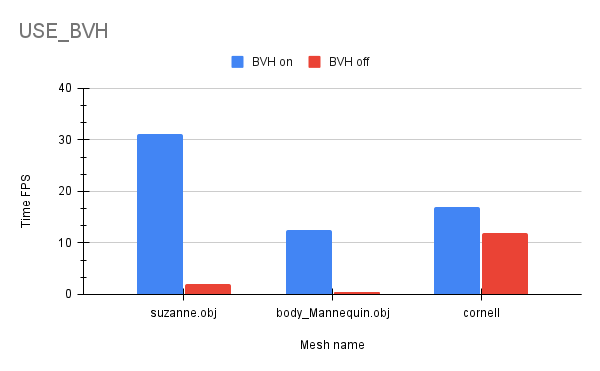

CUDA Path Tracer
================

**University of Pennsylvania, CIS 565: GPU Programming and Architecture, Project 3**

* Jiangman(Lobi) Zhao
  * [Lobi Zhao - LinkedIn](https://www.linkedin.com/in/lobizhao/), [Lobi Zhao - personal website](https://lobizhao.github.io/).
* Tested on: Windows 11 Pro, i5-10600KF @ 4.10GHz 32GB, RTX 3080 10GB


<div align="center">Unreal Engine Animation show case - 'SKM_Manny.obj'</div>


## Part 1
### Basic BSDF
<div align="center">
  
  <br>
  Suzanne.obj
</div>

Implemented a unified shading kernel supporting multiple material types.
-  BSDF Evaluation Shading Kernel 
```
__global__ void shadeMaterial_with_BSDF()
...
__host__ __device__ void scatterRay()
```

### Material Sorting
- Material-based Memory Contiguity
```
Purpose: Reduce GPU warp divergence by grouping rays with same material types.

Controlled by #define SORT_MATERIAL for easy performance comparison.

Implementation: thrust::stable_sort_by_key sorts paths by material ID before shading.
```
### Stochastic Antialiasing
<table>
  <tr>
    <td></td>
    <td></td>
  </tr>
</table>
- Implemented sub-pixel sampling for edge smoothing

```
Control: Enabled via #define ANTI_ALIASING 1

Implementation: u01(rng) generates random offsets in [0,1) range for ray generation
```

### analysis
## Part 2
#### Refraction
<div align="center">
  
  <br>
  cornell_suzanne.json
</div>

- Implemented physically accurate refraction for transparent materials like glass

```
 Entry/Exit Detection: bool entering = cosTheta > 0
 Schlick Fresnel Approximation: Implemented schlickFresnel() function
 Total Internal Reflection: if (glm::length(refracted) < 0.001f)
 Material Configuration: JSON "TYPE": "Refractive" support
```
#### Camera
- Depth of field
<table>
  <tr>
    <td></td>
    <td></td>
  </tr>
</table>
<center>cornell_suzanne.json</center> 
<center>"LENS_RADIUS" and "FOCAL_DISTANCE"</center> 

- Simulates real camera lens with configurable aperture size and focal distance. Objects at focal distance appear sharp while foreground and background objects blur naturally based on distance from focal plane.

- Random sampling across circular lens aperture for each ray using uniform polar coordinate distribution. Generates realistic bokeh effects through Monte Carlo convergence over multiple iterations.

```
#if DEPTH_OF_FIELD
    // compute focal point
    glm::vec3 focalPoint = cam.position + cam.focalDistance * rayDir;
    
    float theta = u01(rng) * 2.0f * 3.14159265f;
    float r = cam.lensRadius * sqrt(u01(rng));
    glm::vec3 lensOffset = r * (cos(theta) * cam.right + sin(theta) * cam.up);
  
    segment.ray.origin = cam.position + lensOffset;
    segment.ray.direction = glm::normalize(focalPoint - segment.ray.origin);
```
#### Load Mesh & Env
<div align="center">
  
  <br>
  suzanne.json & Blue_stripe.hdr
</div>

- Mesh Loading Workflow (Custom OBJ Loader - src/objLoader.cpp, Scene Integration - src/scene.cpp)

  Custom OBJ Parser: Implemented lightweight OBJ loader supporting vertices, normals, and faces with v//vn format. Parses geometry data and applies world transformations including translation, rotation, and scaling. Each mesh is assigned a single material ID and integrated into the scene's triangle array.

  Scene Integration: Meshes are loaded via JSON configuration and transformed to world coordinates using transformation matrices. Normal vectors are properly transformed using inverse transpose matrices to maintain correct lighting calculations.

- BVH Acceleration Structure (BVH Construction - src/bvh.cpp)
  <div align="center">
    
    <br>
    suzanne.obj - 16689 triangles

    Manny_Skm.obj - 73184 triangles
  </div>

  Built using Surface Area Heuristic for optimal partitioning. Combines both primitive geometry (spheres, cubes) and triangle meshes into a unified acceleration structure. Uses 12-bucket SAH evaluation to minimize intersection cost.

  GPU Traversal: Implements stack-based iterative traversal optimized for GPU execution. Uses linear memory layout for cache efficiency and supports both geometry primitives and triangle meshes in the same BVH tree.

  Performance: Reduces intersection complexity from O(n) to O(log n), enabling efficient rendering of complex meshes with thousands of triangles. Build statistics show construction time and node count for performance analysis.

    ```
    BVHAccel::BVHAccel(std::vector<std::shared_ptr<Primitive>>& prims, int maxPrimsInNode)
    ...
    BVHBuildNode* BVHAccel::recursiveBuild(
    std::vector<Primitive>& primitiveInfo,
    int start, int end, int* totalNodes,
    std::vector<std::shared_ptr<Primitive>>& orderedPrims)
    ...
    __global__ void computeIntersectionsBVH(
    int depth, int num_paths,
    PathSegment* pathSegments,
    Geom* geoms, int geoms_size,
    Triangle* triangles, int triangles_size,
    LinearBVHNode* bvhNodes,
    ShadeableIntersection* intersections)

    ```

- HDR Environment Map Loading (src/texture.cpp)

  HDR data is transferred to CUDA texture objects for hardware-accelerated sampling. Creates cudaTextureObject_t with linear filtering and wrap addressing modes. Supports both HDR (float4) and standard (uchar4) texture formats with automatic format detection.

  ```
  // Loading Process
  envMap.loadToCPU(fullenvpath);           // CPU loading
  envmapHandle = scene->envMap.loadToCuda(); // GPU transfer

  // JSON Configuration
  "EnvMap": {
    "PATH": "../scenes/Blue_stripe.hdr"
  }
  ```
#### Performance
- Stream Compaction
<table>
  <tr>
    <td></td>
    <td></td>
  </tr>
</table>

<div align="center">
  
  <br>
  suzanne.json & Blue_stripe.hdr
</div>


**Path Termination Detection** 

- Condition: remainingBounces > 0
- Purpose: To identify paths that still need to be traced.

**Memory Compaction**

- Uses thrust::stable_partition.
- Moves the active paths to the beginning of the array.

```
#if COMPACTION
if (depth % 2 == 1 || depth == traceDepth - 1) {
    auto lastPath = dev_paths + num_paths;
    auto mid = thrust::stable_partition(thrust::device, 
    dev_paths, lastPath, IsAlive{});
    num_paths = mid - dev_paths; 
}
#endif
```

### BETTER_RANDOM

- Enhanced random number generator providing improved distribution quality and performance optimization

```
Control: #define BETTER_RANDOM 1 (currently enabled)

Original Method: utilhash() - Simple bit-manipulation hash function
int h = utilhash((1 << 31) | (depth << 22) | iter) ^ utilhash(index);

Improved Method: fastHash() - Optimized 32-bit hash algorithm
uint32_t seed = index + (iter << 16) + (depth << 8);
return thrust::default_random_engine(fastHash(seed));

Performance Gains: Reduces hash collisions, provides more uniform random distribution
Applications: Ray generation, material sampling, antialiasing, depth of field effects
```

- 改进的随机数生成器，提供更好的随机性分布和性能优化

```
控制开关: #define BETTER_RANDOM 1 (当前启用)

原始方法: utilhash() - 基于位操作的简单哈希函数
int h = utilhash((1 << 31) | (depth << 22) | iter) ^ utilhash(index);

改进方法: fastHash() - 优化的32位哈希算法
uint32_t seed = index + (iter << 16) + (depth << 8);
return thrust::default_random_engine(fastHash(seed));

性能提升: 减少哈希冲突，提供更均匀的随机数分布
应用场景: 光线生成、材质采样、抗锯齿、景深效果等所有需要随机数的场景
```

- 改进的随机数生成器，提供更好的随机性分布和性能优化

```
控制开关: #define BETTER_RANDOM 1 (当前启用)

原始方法: utilhash() - 基于位操作的简单哈希函数
int h = utilhash((1 << 31) | (depth << 22) | iter) ^ utilhash(index);

改进方法: fastHash() - 优化的32位哈希算法
uint32_t seed = index + (iter << 16) + (depth << 8);
return thrust::default_random_engine(fastHash(seed));

性能提升: 减少哈希冲突，提供更均匀的随机数分布
应用场景: 光线生成、材质采样、抗锯齿、景深效果等所有需要随机数的场景
```

### Russian Roulette Ray Termination

- 实现概率性路径终止优化，减少低贡献光线的计算开销

```
终止阈值: 当 remainingBounces < 3 时应用
存活概率: 80% 继续追踪 (20% 终止)
重要性加权: 存活光线乘以 1.25f 保持无偏估计
控制开关: #define RUSSIAN_ROULETTE 0 (当前禁用)
```

### Summary

## Bloopers

<div align="center">
  
  <br>
  Ray scatter
</div>

<div align="center">
  
  <br>
  Glass material error
</div>


