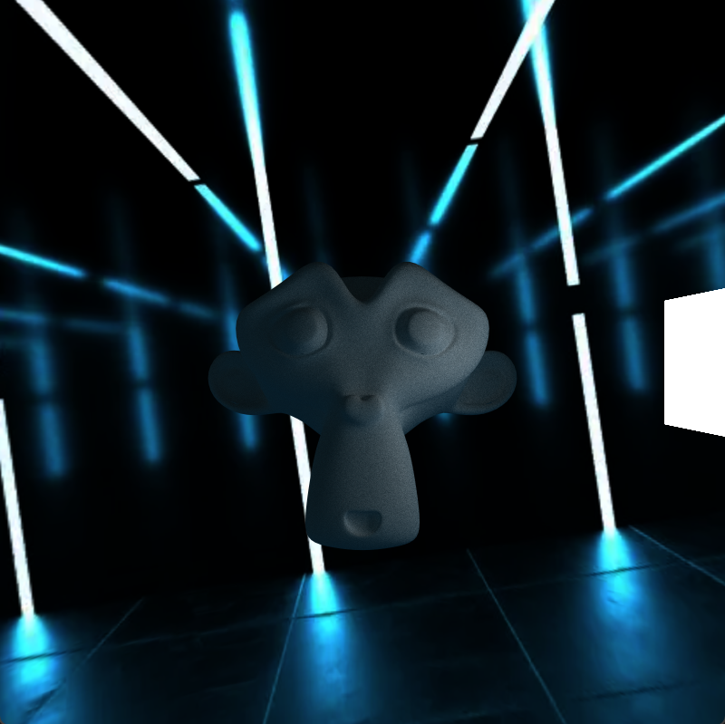

CUDA Path Tracer
================

**University of Pennsylvania, CIS 565: GPU Programming and Architecture, Project 3**

* Jiangman(Lobi) Zhao
  * [Lobi Zhao - LinkedIn](https://www.linkedin.com/in/lobizhao/), [Lobi Zhao - personal website](https://lobizhao.github.io/).
* Tested on: Windows 11 Pro, i5-10600KF @ 4.10GHz 32GB, RTX 3080 10GB


<center>Unreal Engine Animation show case - 'SKM_Manny.obj'</center> 


## Part 1
### Basic BSDF

<center>'Suzanne.obj'</center> 

Implemented a unified shading kernel supporting multiple material types.
-  BSDF Evaluation Shading Kernel 
```
__global__ void shadeMaterial_with_BSDF()
...
__host__ __device__ void scatterRay()
```

### Material Sorting
- Material-based Memory Contiguity
```
Purpose: Reduce GPU warp divergence by grouping rays with same material types.

Controlled by #define SORT_MATERIAL for easy performance comparison.

Implementation: thrust::stable_sort_by_key sorts paths by material ID before shading.
```
### Stochastic Antialiasing
<table>
  <tr>
    <td></td>
    <td></td>
  </tr>
</table>
- Implemented sub-pixel sampling for edge smoothing

```
Control: Enabled via #define ANTI_ALIASING 1

Implementation: u01(rng) generates random offsets in [0,1) range for ray generation
```

### analysis
## Part 2
#### Refraction

<center>'cornell_suzanne.json'</center> 

- Implemented physically accurate refraction for transparent materials like glass

```
 Entry/Exit Detection: bool entering = cosTheta > 0
 Schlick Fresnel Approximation: Implemented schlickFresnel() function
 Total Internal Reflection: if (glm::length(refracted) < 0.001f)
 Material Configuration: JSON "TYPE": "Refractive" support
```
#### Camera
- Depth of field
<table>
  <tr>
    <td></td>
    <td></td>
  </tr>
</table>
<center>cornell_suzanne.json</center> 
<center>"LENS_RADIUS" and "FOCAL_DISTANCE"</center> 

```
#if DEPTH_OF_FIELD
    // compute focal point
    glm::vec3 focalPoint = cam.position + cam.focalDistance * rayDir;
    
    float theta = u01(rng) * 2.0f * 3.14159265f;
    float r = cam.lensRadius * sqrt(u01(rng));
    glm::vec3 lensOffset = r * (cos(theta) * cam.right + sin(theta) * cam.up);
  
    segment.ray.origin = cam.position + lensOffset;
    segment.ray.direction = glm::normalize(focalPoint - segment.ray.origin);
```
#### Geometry
#### Env
#### Performance
- Stream Compaction
<table>
  <tr>
    <td></td>
    <td></td>
  </tr>
</table>


**Path Termination Detection** 

- Condition: remainingBounces > 0
- Purpose: To identify paths that still need to be traced.

**Memory Compaction**

- Uses thrust::stable_partition.
- Moves the active paths to the beginning of the array.

```
#if COMPACTION
if (depth % 2 == 1 || depth == traceDepth - 1) {
    auto lastPath = dev_paths + num_paths;
    auto mid = thrust::stable_partition(thrust::device, 
    dev_paths, lastPath, IsAlive{});
    num_paths = mid - dev_paths; 
}
#endif
```
#### analysis
### Summary

